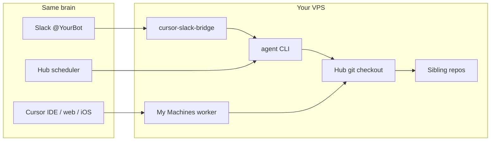
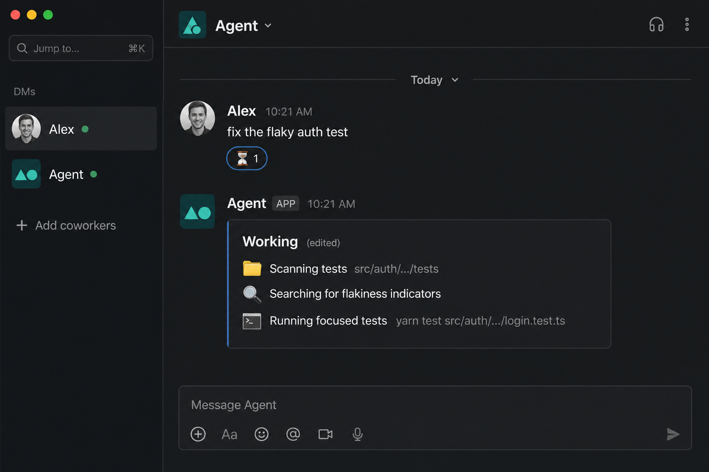
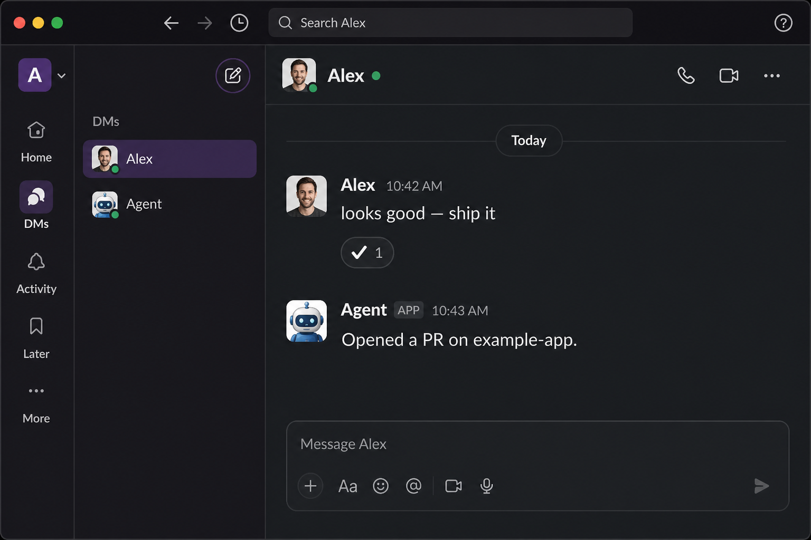

# cursor-slack-bridge

[](https://github.com/zenmindhacker/cursor-slack-bridge/actions/workflows/ci.yml)
[](LICENSE)
[](package.json)

**Slack is another face of the same Cursor agent — not a second environment.**

A thin [Bolt](https://docs.slack.dev/tools/bolt-js/) Socket Mode bridge: Slack DM / `@mention` → the headless Cursor [`agent`](https://cursor.com/docs/cli/using) CLI on a workspace you already run. Pair it with [My Machines](https://cursor.com/docs/cloud-agent/self-hosted-guides/my-machines) (“run on your own server”) so Cursor IDE, web, iOS, and Slack all share one hub checkout.

Not an LLM framework. Cursor is the brain. This is transport, policy, and Slack UX.

## Why this exists

Cursor’s native Slack app starts a **Cloud Agent**. You can aim it at a VPS with `worker=my-vps repo=…`, but Slack is still Cursor’s product: you remember flags, Automations on personal plans cannot target My Machines, and the bot is `@Cursor`.

This bridge is the other shape:

| | Native `@Cursor` | This bridge |
|---|---|---|
| Runtime | Cloud Agent (tools may run on My Machines) | Headless `agent` CLI on *your* disk |
| Workspace | `repo=` / channel defaults / Cloud environment | `WORKSPACE` — always your hub |
| Identity | `@Cursor` | `@YourBot` — persona lives in the hub |
| Multi-agent | One Cursor app | One binary, N systemd instances, N hubs |
| Scheduling | Automations (Cloud; not My Machines on personal plans) | Hub `schedules/` + systemd on the VPS |
| Repos | One GitHub repo (or environment) per run | Hub `repos.json` — a fleet of checkouts, kept ff-pulled |

Native Slack is better at thread-history backfill, “Open in Cursor,” and org routing. This stack is better as a personal (or small-fleet) operator with a real disk.

**Each agent owns a workspace.** An ops bot can hold client repos; a family bot can hold homework repos. From Slack or Cursor, that agent reads, edits, and opens PRs. A scheduled hygiene job keeps those trees current. Both faces see the same disk — “keep repos up to date” is hub policy, not a Slack feature.



The hub itself is a separate repo: **[agent-hub-template](https://github.com/zenmindhacker/agent-hub-template)** (`SOUL.md`, skills, sibling registry, optional tick). Clone it (or bring your own), point `WORKSPACE` at it.

## Quick start (dev)

```bash
pnpm install
cp ops/env.example .env   # Slack tokens + WORKSPACE
pnpm test
pnpm typecheck
pnpm build
CURSOR_SLACK_ENV=.env pnpm start
```

Production on a VPS: **[docs/install.md](docs/install.md)**. Slack app from [`manifest.socket.json`](manifest.socket.json) — enable Socket Mode; do **not** enable Slack Agents / `agent_view`.

## Slack UX



- Ack reaction on the user message (⏳) → ✅ / ❌
- One editable draft (`Working…` + tool lines); the final reply replaces it
- Follow-up while a run is in progress: immediate “still working… send `stop` to cancel”
- `ping` / `stop` / `help` — no Cursor run
- Tool lines use Cursor `description` / human labels, not raw `cd && export …`
- Final text = last assistant bubble (not concatenated `result`, not thinking)



## Multi-agent

One install, N instances:

```bash
cp ~/.config/cursor-slack/main.env ~/.config/cursor-slack/family.env
# edit WORKSPACE, tokens, ALLOWED_USER_IDS, SESSION_DB
systemctl --user enable --now cursor-slack@family
```

Each agent needs its own Slack app (one Socket Mode consumer per app-level token) and its own hub checkout.

## Docs

| Doc | |
|-----|---|
| [Why](docs/why.md) | Same-brain thesis vs native Slack vs OpenClaw |
| [Install](docs/install.md) | Slack app, service user, systemd |
| [Architecture](docs/architecture.md) | Events → policy → CLI → reply |
| [My Machines](docs/my-machines.md) | Cursor UI / iOS on the same VPS |
| [Workspaces](docs/workspaces.md) | Per-agent hub + sibling repos |
| [Slack UX](docs/slack-ux.md) | Features and why they exist |
| [Multi-agent](docs/multi-agent.md) | N instances, isolation |
| [Scheduling](docs/scheduling.md) | Hub ticks vs Automations |
| [Credentials](docs/credentials.md) | Optional Agent Vault |
| [Help](docs/help.md) | FAQ and troubleshooting |
| [Example](docs/example-cleo.md) | How we run two agents on one box |

## Security

- Dedicated non-sudo service user
- `DM_POLICY=allowlist` + canonical Slack user IDs
- Slack tokens are **not** passed into the Cursor agent child
- Env files mode `600`

See [SECURITY.md](SECURITY.md).

## License

[MIT](LICENSE)
