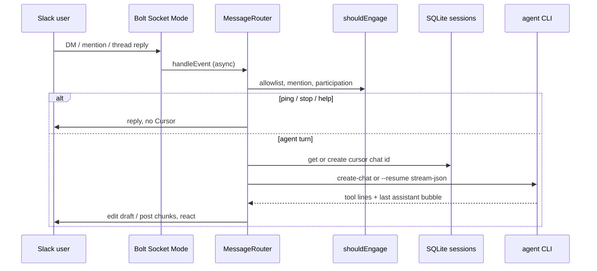

# Architecture

One long-lived Node process per Slack bot. No HTTP webhook server — **Socket Mode** only.

## Modules

| File | Role |
|------|------|
| `src/index.ts` | Bolt app, event subscriptions, Slack API wiring |
| `src/config.ts` | Env → `BridgeConfig` |
| `src/policy.ts` | Engage rules + `ping` / `stop` / `help` |
| `src/router.ts` | Queue, session, agent turn |
| `src/sessions.ts` | SQLite `(channel, thread) → cursor chat` + participation |
| `src/agent-runner.ts` | Spawn `agent`; strip Slack tokens from child env |
| `src/progress.ts` | Reactions, one editable draft, `setStatus` keepalive |
| `src/stream-events.ts` | Parse `stream-json`; last assistant bubble |
| `src/oc-tool-display.ts` | Human tool lines |
| `src/format.ts` | Prompt prefix, chunking |
| `src/blocks.ts` | Block Kit helpers for outbound tick scripts (not chat replies) |

## Sessions

- **DMs:** one Cursor chat per Slack IM (`thread_key = "main"`).
- **Channels:** one Cursor chat per Slack thread (`thread_key = thread_ts`).
- **Participation:** after the bot engages a channel thread, allowlisted replies continue without `@mention`. Scheduled outbound posts should call `scripts/mark-participated.mjs` (Socket Mode does not echo your own `chat.postMessage`).

## Concurrency

Same `(channelId:threadKey)` is serialized. A second message while a run is active gets ⏳ plus “Still working… send `stop`.” `stop` SIGTERMs the child.

## Multi-instance

Not in-process tenancy. systemd template `cursor-slack@.service` loads `~/.config/cursor-slack/%i.env`. See [multi-agent.md](multi-agent.md).

## Trust flags

The CLI is invoked with `--trust --force` because a Slack-driven session cannot click Cursor’s interactive prompts. Treat `WORKSPACE` as the sandbox: the agent can do what the Unix user can do. Use a dedicated service user.
